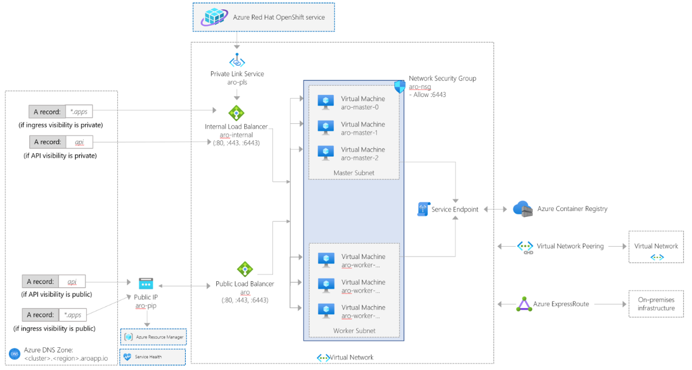
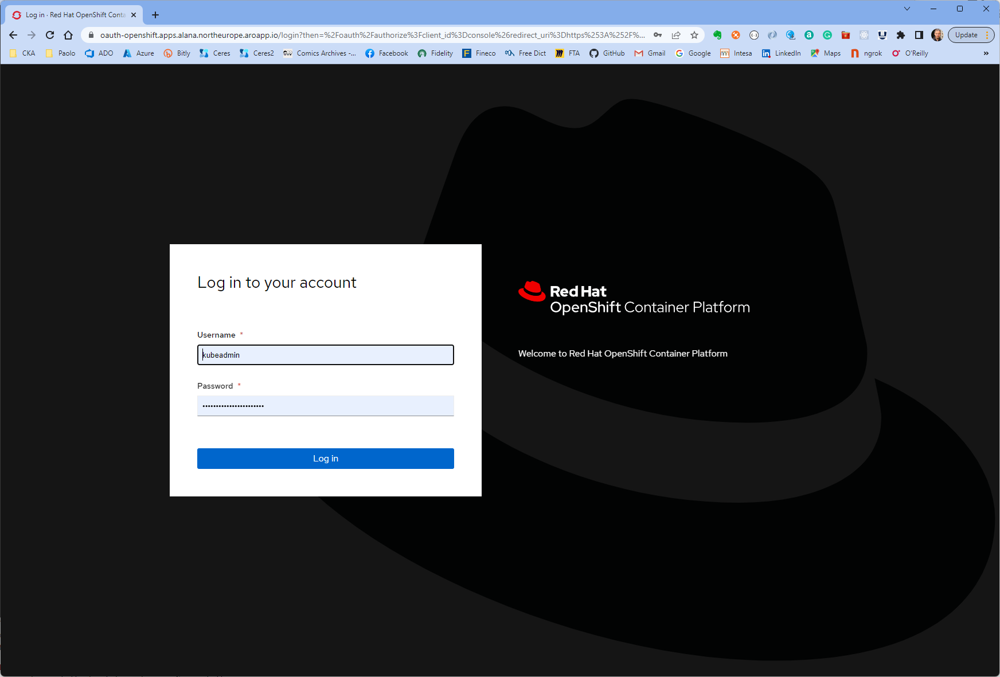
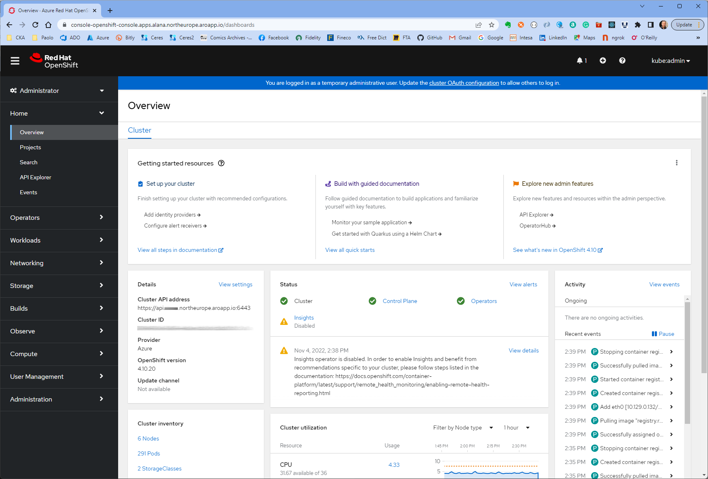
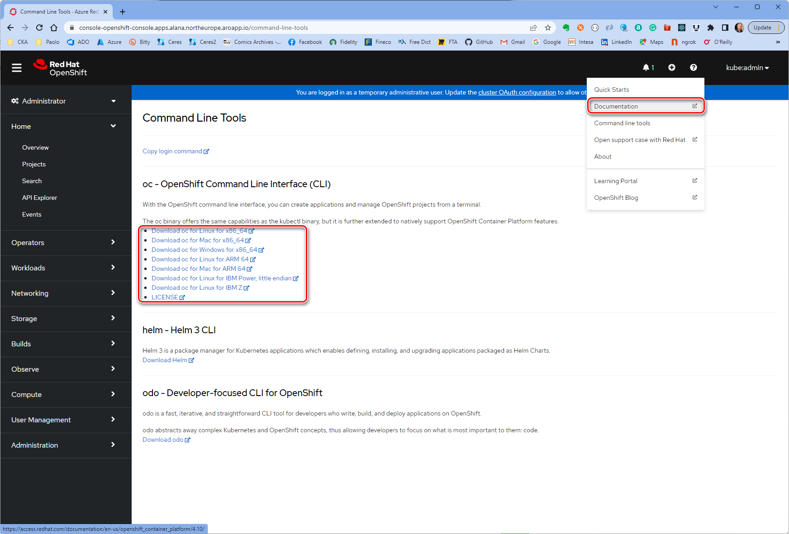

# Deploy an Azure Red Hat OpenShift cluster with Terraform and AzAPI Provider

[Azure Red Hat OpenShift](https://learn.microsoft.com/en-us/azure/openshift/intro-openshift) builds on top and extends [Kubernetes](https://kubernetes.io/) features. [Red Hat OpenShift](https://www.openshift.com/) is a cloud-based Kubernetes platform that helps developers build applications. It offers automated installation, upgrades, and life cycle management. OpenShift gives customers the ability to build, deploy, and scale applications faster both on-premises and in the cloud. It also protects your development infrastructure at scale with enterprise-grade security. Running containers in production with Kubernetes requires additional tools and resources. This often includes needing to juggle image registries, storage management, networking solutions, and logging and monitoring tools - all of which must be versioned and tested together. Building container-based applications requires even more integration work with middleware, frameworks, databases, and CI/CD tools. Azure Red Hat OpenShift combines all this into a single platform, bringing ease of operations to IT teams while giving application teams what they need to execute.

[Azure Red Hat OpenShift](https://learn.microsoft.com/en-us/azure/openshift/intro-openshift) is jointly engineered, operated, and supported by Red Hat and Microsoft to provide an integrated support experience. There are no virtual machines to operate, and no patching is required. Master, infrastructure, and application nodes are patched, updated, and monitored on your behalf by Red Hat and Microsoft. Your Azure Red Hat OpenShift clusters are deployed into your Azure subscription and are included on your Azure bill.

You can choose your own registry, networking, storage, and CI/CD solutions, or use the built-in solutions for automated source code management, container and application builds, deployments, scaling, health management, and more. Azure Red Hat OpenShift provides an integrated sign-on experience through Azure Active Directory. For more information, see [Azure Red Hat OpenShift](https://learn.microsoft.com/en-us/azure/openshift/intro-openshift).

## Prerequisites

- If you want to run Azure CLI locally, install [Azure CLI](https://learn.microsoft.com/en-us/cli/azure/install-azure-cli)
- An Azure account with an active subscription is required. If you don't already have one, you can [create an account for free](https://azure.microsoft.com/free/?WT.mc_id=A261C142F). If you don't have one, create a [free Azure account](https://azure.microsoft.com/free/) before you begin.
- [Visual Studio Code](https://code.visualstudio.com/) installed on one of the [supported platforms](https://code.visualstudio.com/docs/supporting/requirements#_platforms) along with the [HashiCorp Terraform](hhttps://marketplace.visualstudio.com/items?itemName=HashiCorp.terraform).
- Ability to assign User Access Administrator and Contributor roles. If you lack this ability, contact your Azure Active Directory admin to manage roles.
- A Red Hat account. If you don't have one, you'll have to [register for an account](https://www.redhat.com/wapps/ugc/register.html).
- A pull secret for your Azure Red Hat OpenShift cluster. [Download the pull secret file from the Red Hat OpenShift Cluster Manager web site](https://cloud.redhat.com/openshift/install/azure/aro-provisioned).
- If you want to run the Azure PowerShell code locally, [Azure PowerShell](/powershell/azure/install-az-ps).

## What is AzAPI Provider?

The [AzAPI Provider](https://registry.terraform.io/providers/azure/azapi/latest/docs) is a very thin layer on top of the Azure ARM REST APIs. This provider compliments the [AzureRM provider](https://registry.terraform.io/providers/hashicorp/azurerm/latest/docs) by enabling the management of Azure resources that are not yet or may never be supported in the AzureRM provider such as private/public preview services and features. The [AzAPI provider](https://docs.microsoft.com/en-us/azure/developer/terraform/overview-azapi-provider) enables you to manage any Azure resource type using any API version. This provider complements the AzureRM provider by enabling the management of new Azure resources and properties (including private preview). For more information, see [Overview of the Terraform AzAPI provider](https://docs.microsoft.com/en-us/azure/developer/terraform/overview-azapi-provider).

## Architecture

This sample contains Terraform modules to create the following resources:

- A virtual network hosting the master and worker nodes of the Azure Red Hat OpenShift cluster.
- A `master` subnet hosting the master nodes of the the Azure Red Hat OpenShift cluster.
- A `worker` subnet hosting the worker nodes of the the Azure Red Hat OpenShift cluster.
- An Azure Red Hat OpenShift cluster
- A role assignment that assigns the `Contributor` role to the cluster service principal scoped to the virtual network resource.
- A role assignment that assigns the `Contributor` role to the service principal of the Azure Red Hat OpenShift resource provider scoped to the virtual network resource.

The following architecture diagram illustrates the network topology of an Azure Red Hat OpenShift cluster. 



For more information, see [Network concepts for Azure Red Hat OpenShift](https://learn.microsoft.com/en-us/azure/openshift/concepts-networking).


## Deploy the sample

To deploy ARO cluster and also generate `kubeconfig` containing the newly created ARO cluster's admin credentials,
execute following command:
```
./deploy.sh
```

This script will allow you to perform following functions:
* Initialize `terraform`
* Validate config
* `plan`
* `apply` the changes (either by itself or after `plan`)
* `destroy` existing ARO cluster
* `delete` existing resource group

Some of the options will prompt for the following variable values:
* Resource prefix
* Location
* Timeout for resource creation

All of these fields have default values but can be overridden by providing
new values. Once all the values are provided the script invokes `terraform`
by passing in the input values to corresponding variables needed by the
Terraform scripts.

When this script is run for the first time and either plan or apply (without running plan first)
is chosen then this script will also perform following actions:
* Registers following `az` providers:
  * Microsoft.RedHatOpenShift
  * Microsoft.Compute
  * Microsoft.Storage
  * Microsoft.Authorization
* Creates a Resource Group using the provided prefix
* Creates a Service Principal using the specified prefix
* Assigns the following two roles to the new service principal with resource group scope:
  * User Access Administrator
  * Contributor

This script uses various values from above resources to invoke Terraform to create the ARO cluster.

You can run this script by first selecting `plan` option and then re-running and selecting `apply` option.


This script uses an [azapi_resource](https://docs.microsoft.com/en-us/azure/developer/terraform/overview-azapi-provider)
to create a resource of type [Microsoft.RedHatOpenShift/openShiftClusters](https://learn.microsoft.com/en-us/azure/templates/microsoft.redhatopenshift/2020-04-30/openshiftclusters?pivots=deployment-language-bicep).
You can use an [azapi_resource](https://docs.microsoft.com/en-us/azure/developer/terraform/overview-azapi-provider) 
to fully manage any Azure (control plane) resource (API) with full CRUD. Example Use Cases:
- New preview service
- New feature added to existing service
- Existing feature or service not currently supported by the AzureRM provider

For more information, see [Overview of the Terraform AzAPI provider](https://docs.microsoft.com/en-us/azure/developer/terraform/overview-azapi-provider).

_All the resources deployed by the modules share the same resource prefix._

**Before deploying the cluster, download a pull secret for your Azure Red Hat OpenShift cluster and
copy the file to the same folder of the `deploy.sh` script file with the name `pull-secret.txt`.**
For more information, see [how to download the pull secret file from the Red Hat OpenShift Cluster Manager web site](https://cloud.redhat.com/openshift/install/azure/aro-provisioned).


## Connect to the cluster

You can log into the cluster using the `kubeadmin` user.  Run the following command to find the password for the `kubeadmin` user.

```bash
az aro list-credentials \
  --name $CLUSTER \
  --resource-group $RESOURCEGROUP
```

The following example output shows what the password will be in `kubeadminPassword`.

```json
{
  "kubeadminPassword": "<generated password>",
  "kubeadminUsername": "kubeadmin"
}
```

You can find the cluster console URL by running the following command, which will look like `https://console-openshift-console.apps.<random>.<region>.aroapp.io/`.

```bash
 az aro show \
    --name $CLUSTER \
    --resource-group $RESOURCEGROUP \
    --query "consoleProfile.url" -o tsv
```

Launch the console URL in a browser and login using the `kubeadmin` credentials.



If entered credentials are correct, you will have access to the [OpenShift Web Console](https://docs.openshift.com/container-platform/4.6/web_console/web-console-overview.html) that provides a graphical user interface to visualize your project data and perform administrative, management, and troubleshooting tasks.



## Install the OpenShift CLI

Once you're logged into the OpenShift Web Console, click on the **?** on the top right and then on **Command Line Tools**. Download the release appropriate to your machine.



You can also download the [latest release of the CLI](https://mirror.openshift.com/pub/openshift-v4/clients/ocp/latest/) appropriate to your machine.

If you're running the commands on the Azure Cloud Shell, download the latest OpenShift 4 CLI for Linux.

```bash
cd ~
wget https://mirror.openshift.com/pub/openshift-v4/clients/ocp/latest/openshift-client-linux.tar.gz

mkdir openshift
tar -zxvf openshift-client-linux.tar.gz -C openshift
echo 'export PATH=$PATH:~/openshift' >> ~/.bashrc && source ~/.bashrc
```

## Connect using the OpenShift CLI

Retrieve the API server's address.

```bash
apiServer=$(az aro show -g $RESOURCEGROUP -n $CLUSTER --query apiserverProfile.url -o tsv)
```

Login to the OpenShift cluster's API server using the following command. Replace **\<kubeadmin password>** with the password you just retrieved.

```bash
oc login $apiServer -u kubeadmin -p <kubeadmin password>
```

## Next steps

In this article, you learned how to create an Azure Red Hat OpenShift cluster running OpenShift 4 using the [AzAPI Provider](https://registry.terraform.io/providers/azure/azapi/latest/docs) and [Terraform](hhttps://marketplace.visualstudio.com/items?itemName=HashiCorp.terraform).

Advance to the next article to learn how to configure the cluster for authentication using Azure Active Directory.

- [Rotate service principal credentials for your Azure Red Hat OpenShift (ARO) Cluster](https://learn.microsoft.com/en-us/azure/openshift/howto-service-principal-credential-rotation)
- [Configure authentication with Azure Active Directory using the command line](https://learn.microsoft.com/en-us/azure/openshift/configure-azure-ad-cli)
- [Configure authentication with Azure Active Directory using the Azure portal and OpenShift web console](https://learn.microsoft.com/en-us/azure/openshift/configure-azure-ad-cli)